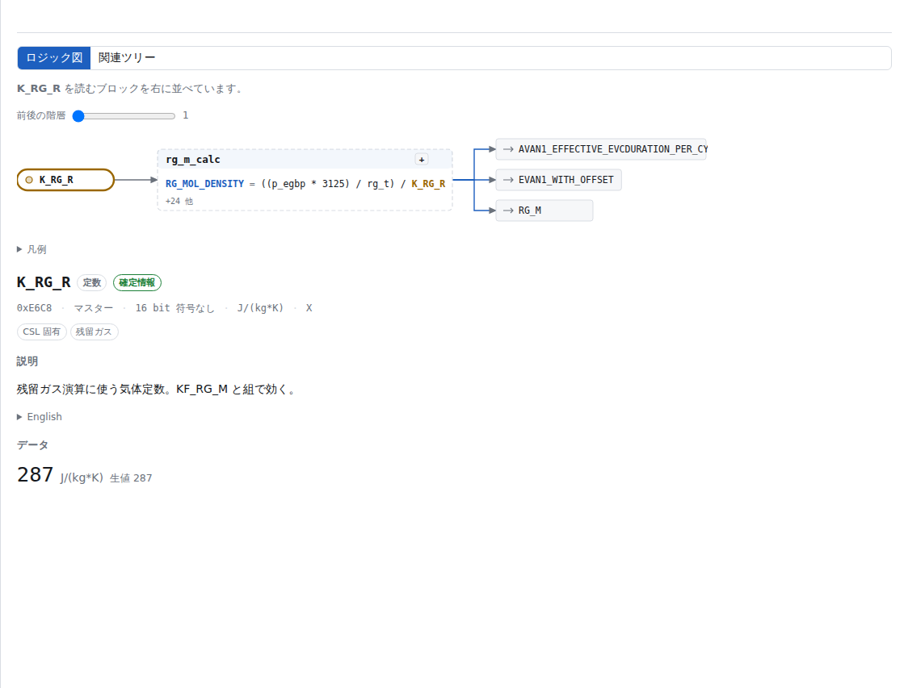
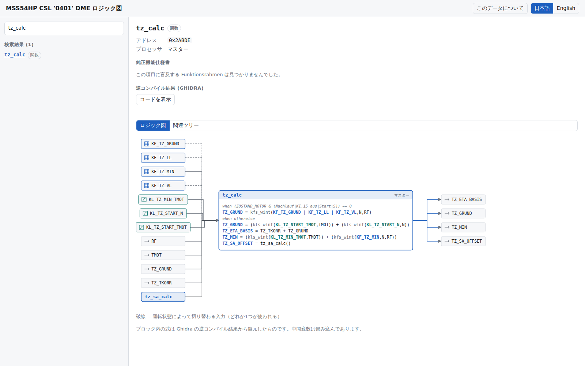
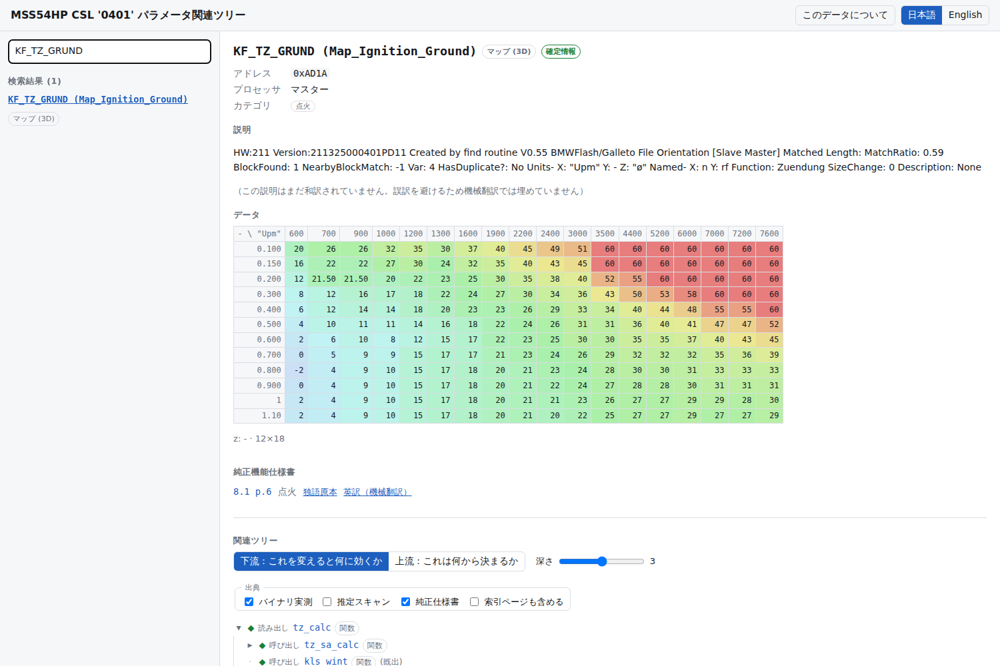
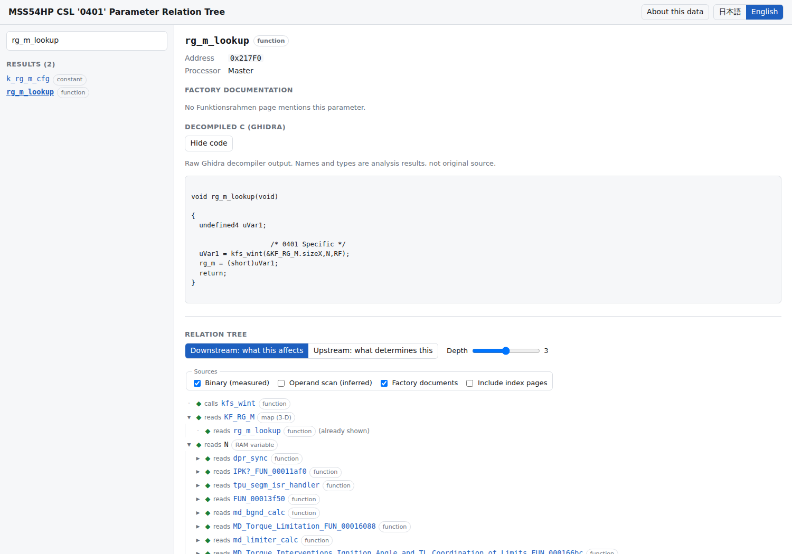
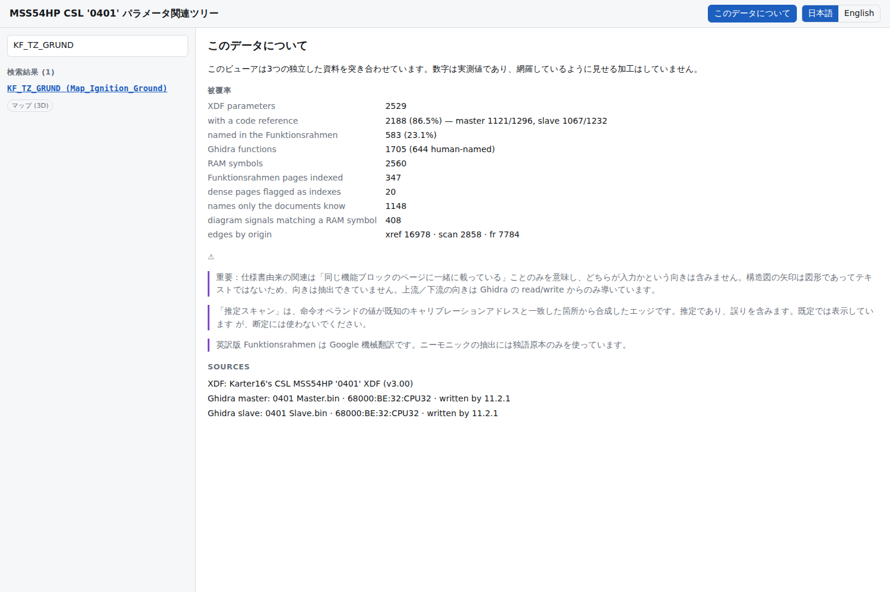
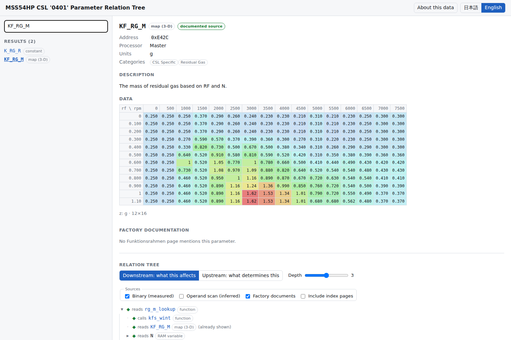

# MSS54HP CSL '0401' DME ロジック図ビューア / DME Logic Diagram Viewer

[日本語](#日本語) · [English](#english)

---

## 日本語

### これは何か

MSS54HP（E46 M3 CSL、プログラム `0401`）の DME の**ロジック図**をブラウザで辿れるビューアです。

**メインはブロック図です。** ブロックの中には実バイナリから復元した計算式が入り、左に入力（3Dマップ・2Dカーブ・定数・信号）、右に出力が並びます。どの値がどのテーブルから来ているのかが一目で分かります。

```
KF_TZ_GRUND ┐(3Dマップ)          ┌─────────────────────────────────────────┐
KF_TZ_LL    ├╌╌╌╌╌╌╌╌╌╌╌╌╌╌╌╌╌╌→ │ tz_calc                                 │ → TZ_GRUND
KF_TZ_VL    ┘  破線=状態で切替     │ when 始動でない:                          │ → TZ_ETA_BASIS
KL_TZ_START_N   (2Dカーブ) ────→  │  TZ_GRUND = kfs_wint({3つのマップ},N,RF) │ → TZ_MIN
KL_TZ_START_TMOT ─────────────→  │ when それ以外:                           │ → TZ_SA_OFFSET
N, RF, TMOT      (信号) ───────→  │  TZ_GRUND = kls_wint(KL_TZ_START_TMOT…) │
                                 └─────────────────────────────────────────┘
```

上の `{KF_TZ_GRUND | KF_TZ_LL | KF_TZ_VL}` は「運転状態（アイドル/部分負荷/全負荷）によって3つのうちどれかが使われる」という意味で、破線で描かれます。

答えの材料はこのリポジトリに元から3つ揃っていましたが、互いに分断されていました。

| 資料 | 何が分かるか | 分からないこと |
|---|---|---|
| `XDF/CSL_0401_Karter16_v3_6_publish.xdf` | パラメータ 2,529件の名前・アドレス・スケーリング・カテゴリ | 互いの関係 |
| `MSS54 Funktionsrahmen/` | 純正が文書化した機能ブロックと信号名 | `0401` の実装が本当にそうなっているか |
| `MSS54_Disassembly_2025_09_16.gar` | 実バイナリ上の関数・参照・RAM変数 | 各アドレスの物理的な意味 |

このツールはこの3つをアドレスとニーモニックで機械的に突き合わせ、1画面にまとめます。





### 使う

**利用するだけなら Ghidra も Java も不要です。** 生成済みの JSON がリポジトリに入っています。

```bash
cd app
npm ci
npm run dev
```

### 1枚の HTML ファイルとして持ち出す

Node が使えない環境や、そのまま人に渡したい場合は単一ファイル版を作れます。
グラフ・逆コンパイル結果・コードをすべて埋め込むため、**サーバーも通信も不要**で、
ダブルクリックするだけで開きます。

```bash
cd app
npm ci
npm run build:single      # → app/dist-single/mss54hp-parameter-tree.html (約5.4MB)
```

### GitHub Pages で公開する場合

ビルドは常に CI で走りますが、**デプロイは明示的に有効化するまで動きません**。
`actions/deploy-pages` はリポジトリで Pages が有効になっていないと 404 を返し、
これはワークフロー側からは設定できないためです。

1. Settings → Pages → Build and deployment → Source を **GitHub Actions** にする
2. Settings → Secrets and variables → Actions → Variables で
   リポジトリ変数 **`ENABLE_PAGES` = `true`** を追加する

### ブロック内の計算式はどう作られているか

Ghidra の逆コンパイル結果をそのまま出すと、こうなります。

```c
uVar1 = kfs_wint(&KF_TZ_GRUND.sizeX,N,RF);
TZ_GRUND = (short)uVar1;
```

`uVar1` を計算するブロックを図にしてもチューナーには何も伝わらないので、**中間変数を畳み込んで**います。畳み込みは代入順に沿った到達定義で行う必要があります（逆コンパイラは `uVar1` を関数内で使い回すため）。ローカル変数は名前で推測せず、**関数先頭の宣言部を読んで特定**しています。

分岐で値が変わる中間変数は潰さず、`{A | B | C}` として全ての候補を残します。`tz_calc` が運転状態で3つの点火マップを使い分ける、というのがこのブロックで一番重要な情報だからです。

補間ヘルパは命名規則で判別します: `kf`=Kennfeld(3Dマップ) / `kl`=Kennlinie(2Dカーブ)、`s`/`u`=符号付き/なし、`w`/`b`=16/8bit。全8種＋`tableLookup`＋PT1/IIRフィルタを認識します。

大きなブロック（例: `md_limiter_calc` は32文）では、**マップ・カーブ・定数を使う行を優先**して表示し、残りは件数を出して展開できるようにしています。黙って切り捨てません。

### 出典の区別 — ここが一番大事

ツリーの各エッジには必ず出典が付きます。**混ぜていません。**

| 記号 | 出典 | 信頼度 |
|---|---|---|
| ◆ | **バイナリ実測** — Ghidra が実コードから解決した参照 | 断定してよい |
| ◇ | **推定スキャン** — 命令オペランドの値が既知のキャリブレーションアドレスと一致した箇所 | 推定。誤りを含む |
| § | **純正仕様書** — 同じ Funktionsrahmen ページに載っている | 純正仕様。`0401` 実装との差異はありうる |

**仕様書由来の関連に「向き」はありません。** 構造図の矢印はベクター図形でテキストではないため、どちらが入力かは抽出できていません。「同じ機能ブロックに一緒に載っている」ことのみを意味します。上流／下流の向きは Ghidra の read/write からのみ導いています。

◆ と § の両方が立つ箇所は「仕様一致」バッジが出ます。**§ だけで ◆ が無い箇所は、純正仕様には書かれているが 0401 バイナリでは未確認**という意味で、チューナーが最も見るべき場所です。

点火の基本マップ `KF_TZ_GRUND` を開いたところ。純正仕様書 8.1 p.6 へのリンクが付きます。



関数を選ぶと Ghidra の逆コンパイル結果が読めます。`KF_RG_M` を回転数 `N` と相対充填量 `RF` で補間していることがコード上で確認できます。



### 実測された被覆率

| 項目 | 数 |
|---|---|
| XDF パラメータ | 2,529 |
| うちコード参照があるもの | 2,188（86.5%）— マスター 1,121/1,296、スレーブ 1,067/1,232 |
| うち Funktionsrahmen に名前が出るもの | 583（23.1%） |
| Ghidra 関数 | 1,705（うち人間が命名 644） |
| 逆コンパイル済み関数 | 644 |
| RAM シンボル | 2,560 |
| 索引化した仕様書ページ | 347 |
| 仕様書にしか存在しない名前 | 1,148 |
| エッジ | 実測 16,978 / 推定 2,858 / 仕様書 7,784 |
| 計算式を復元できたブロック | 534 |
| 検出したマップ/カーブ補間 | 295（カーブ177 / マップ67 / フィルタ55 相当） |

網羅しているように見せる加工はしていません。上の数字はアプリの「このデータについて」にもそのまま出ます。



### 分かったこと（実装中に実測で確定した事実）

1. **XDF は両プロセッサを含む。** 64KB 空間の `0x0000–0x7FFF` がスレーブ、`0x8000–0xFFFF` がマスター。
   `cfg_m.baureihe` が `0x8006`、`cfg_s.baureihe` が `0x0006` で差はちょうど `0x8000`。
   スレーブ側のデータは 1MB イメージ上では **`アドレス + 0x88000`** にある（スレーブ像が `0x80000` 始まり、その中のパラメータ空間が `0x8000`）。
   スレーブ側 x軸 219本すべてがこのオフセットで単調な階段になり、生アドレスでは 3/219 しか成立しません。

2. **Ghidra 側のキャリブレーションは `Mapped Parameter Space` (`0x88000–0x8FFFF`) に注釈されている。**
   生イメージの `Parameter Space` (`0x8000–0xFFFF`) ではありません（そちらは定義データ18件のみ）。
   統一形は **`0x88000 + (XDFアドレス mod 0x8000)`**。これを間違えると被覆率が 86.5% から **0.6%** に落ちます。

3. **マップ／カーブのブロックは2バイトのヘッダで始まる。** 逆コンパイル結果の `kfs_wint(&KF_RG_M.sizeX, N, RF)` がこれを裏付けています。

4. **構造図のラベルは区切り無しで連結されて抽出される** (`KL_TZ_START_TMOTKF_TZ_LLKF_TZ_GRUND…`)。接頭辞での分割は `K_MD_TZ_CONTROL` を `K_MD_` に誤分割するため使えず、XDF と Ghidra から作った語彙による最長一致で切り出しています。

### パイプラインを回し直す

```bash
python3 -m venv .venv && .venv/bin/pip install -r tools/requirements.txt

./tools/setup_ghidra.sh                      # Ghidra 12.1.2 + CPU32 パッチ
export GHIDRA_INSTALL_DIR=/path/to/ghidra_12.1.2_PUBLIC
./tools/run_pipeline.sh
.venv/bin/python -m pytest tools/tests -q
```

`.gar` が要求する言語は `68000:BE:32:CPU32` version 1.1 です。CPU32 対応は本家 Ghidra にマージ済みですが**まだリリースには入っていない**ため、`setup_ghidra.sh` が公開版 12.1.2 に本家 master の 68000 言語ファイル4本を当てて `support/sleigh` で再コンパイルします。**Gradle でのフルビルドは不要です。**

### 和訳の方針

UI 文言・71カテゴリ・39文書タイトル・DME 用語集は手作業で和訳しています。
**個々のパラメータ説明は機械翻訳で埋めていません。** 誤訳がチューニング判断を誤らせるためです。和訳が無いものは英語原文のまま表示し、`tools/i18n/ja.params.json` に追記して育てる方式です。

英訳版 Funktionsrahmen は Google 機械翻訳（透かし入り）なので、ニーモニック抽出には独語原本のみを使っています。

---

## English

### What this is

A browser viewer for the MSS54HP (E46 M3 CSL, program `0401`) DME that answers
**"if I change this parameter, what else does it affect?"** and **"what determines
this value?"**

The material was already in this repository, but split across three sources that
did not talk to each other: the TunerPro XDF (2,529 named calibration items with
addresses and scaling), the factory Funktionsrahmen (39 documents describing the
functional blocks), and the Ghidra project (functions, references and RAM symbols
from the actual binary). This tool joins them on addresses and mnemonics.



### Running it

**No Ghidra or Java needed to use it** — the generated JSON is committed.

```bash
cd app && npm ci && npm run dev
```

### Taking it away as one HTML file

Where Node is not available, or to hand the whole thing to someone else, build
the single-file version. The graph, all 644 decompiled listings and the code are
embedded, so it opens straight from the filesystem with **no server and no
network**.

```bash
cd app && npm ci && npm run build:single
# -> app/dist-single/mss54hp-parameter-tree.html (about 5.4 MB)
```

### Publishing to GitHub Pages

The build always runs in CI; **deployment stays off until you switch it on**,
because `actions/deploy-pages` 404s while Pages is disabled and no workflow can
enable it for you.

1. Settings → Pages → Build and deployment → Source: **GitHub Actions**
2. Settings → Secrets and variables → Actions → Variables: add
   **`ENABLE_PAGES` = `true`**

### Sources are never blurred

Every edge carries its origin: **◆ binary (measured)**, **◇ operand scan
(inferred)**, **§ factory documents**.

A documentation edge has **no direction**. The Strukturbild arrows are vector
graphics rather than text, so only co-occurrence on a functional-block page was
extracted. Upstream/downstream comes from Ghidra's read/write classification
alone. Where ◆ and § agree you get a "matches docs" badge; where only § is
present, the factory documents it but the `0401` binary does not confirm it —
which is exactly where a tuner should look.

### Measured coverage

2,529 parameters, 2,188 (86.5%) with a code reference, 583 (23.1%) named in the
Funktionsrahmen, 1,705 functions (644 human-named and decompiled), 2,560 RAM
symbols, 347 indexed document pages, 1,148 names only the documents know.
Edges: 16,978 measured, 2,858 inferred, 7,784 documentary. These numbers are
shown verbatim in the app's About panel; nothing is rounded up to look complete.

### Findings established while building it

- **The XDF covers both CPUs**: `0x0000–0x7FFF` is the Slave, `0x8000–0xFFFF`
  the Master. Slave data lives at file offset `address + 0x88000`; 219 of 219
  slave x axes decode to monotonic ladders there versus 3 of 219 at the raw
  address.
- **Ghidra annotates calibration in the mapped window** `0x88000–0x8FFFF`, not
  in the raw `Parameter Space` image. Getting this wrong drops reference
  coverage from 86.5% to 0.6%.
- **Map and curve blocks start with a two-byte header** — confirmed by the
  decompiler emitting `kfs_wint(&KF_RG_M.sizeX, N, RF)`.
- **Diagram labels extract with no separators** (`KL_TZ_START_TMOTKF_TZ_LL…`),
  so names are cut by longest match against a vocabulary rather than by prefix
  splitting, which would break `K_MD_TZ_CONTROL` at `TZ_`.

### Regenerating

```bash
python3 -m venv .venv && .venv/bin/pip install -r tools/requirements.txt
./tools/setup_ghidra.sh
export GHIDRA_INSTALL_DIR=/path/to/ghidra_12.1.2_PUBLIC
./tools/run_pipeline.sh
.venv/bin/python -m pytest tools/tests -q
```

The archive needs language `68000:BE:32:CPU32` at version 1.1. CPU32 support is
merged upstream but **not in any Ghidra release yet**, so `setup_ghidra.sh` drops
the four upstream 68000 language files onto the public 12.1.2 build and
recompiles them with `support/sleigh`. A Gradle build of Ghidra is not required.

### Translation policy

UI strings, the 71 categories, the 39 document titles and a DME glossary are
translated by hand. **Individual parameter descriptions are not machine
translated** — a mistranslation there would mislead a tuning decision. Untranslated
descriptions stay in English and can be filled in over time via
`tools/i18n/ja.params.json`.
